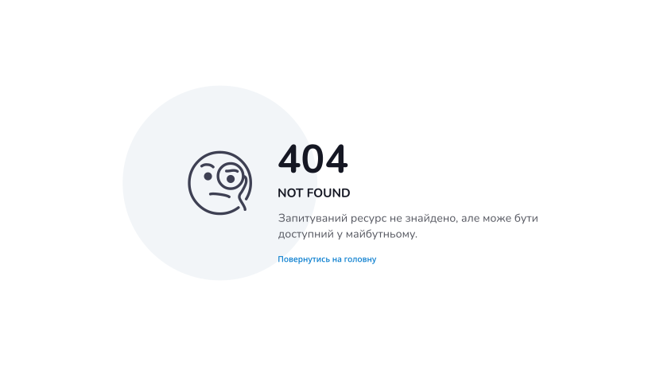

# http-status-pages
Stylized pages with different HTTP status codes.

The idea was based on the [colorlib.com](https://colorlib.com/wp/cat/404-error/) resource, from page [Colorlib Error 404 V18](https://colorlib.com/etc/404/colorlib-error-404-18/). Thanks to [openmoji.org](https://openmoji.org/), where I got some SVG icons.



### Optimized Icons

Some icons have been completely redrawn because their paths duplicated unnecessary nodes. These nodes have been simplified as much as possible to reduce the size of the sprite. Also, some icons have been intentionally resized to achieve the impression of a single, cohesive style. A few more new icons were also added, which at least I didn't find in the openmoji collection. The work is still ongoing.

[](https://openmoji.org/library/emoji-1FA99/)
[](https://openmoji.org/library/emoji-1F9D0/)
[](https://openmoji.org/library/emoji-E0AB/)
[](https://openmoji.org/library/emoji-E145/)

[](https://openmoji.org/library/emoji-1F4A5/)
[](https://openmoji.org/library/emoji-1F383/)
[](https://openmoji.org/library/emoji-1FAAC/)
[](https://openmoji.org/library/emoji-1F9F1/)

[](https://openmoji.org/library/emoji-E308/)
[](https://openmoji.org/library/emoji-E147/)
[](https://openmoji.org/library/emoji-E04B/)

#### Generate pages

``` bash
# install dependencies
npm install

# run builder
npm run build

# or
npx gulp generate

```
